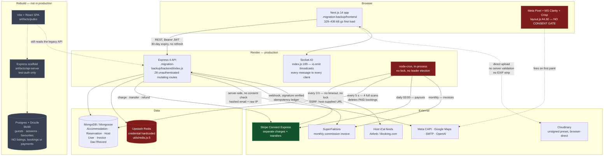
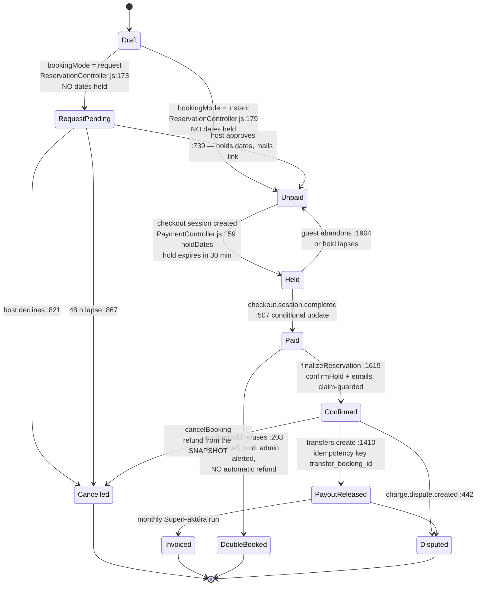
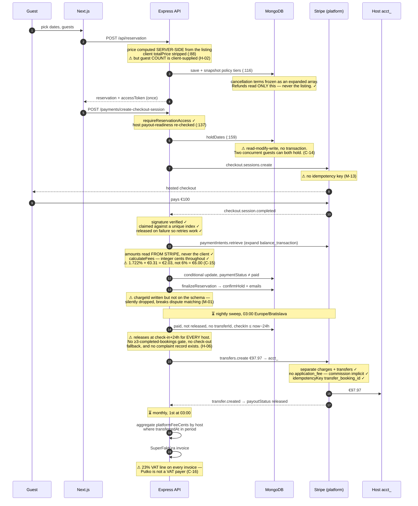
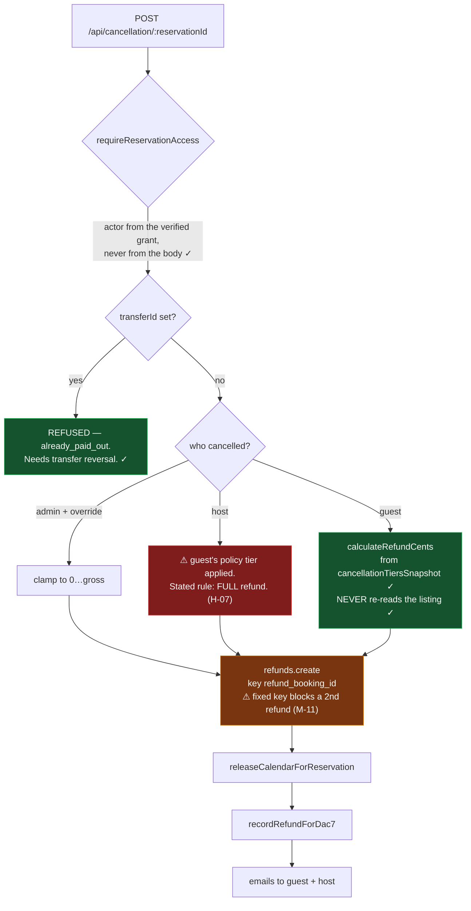
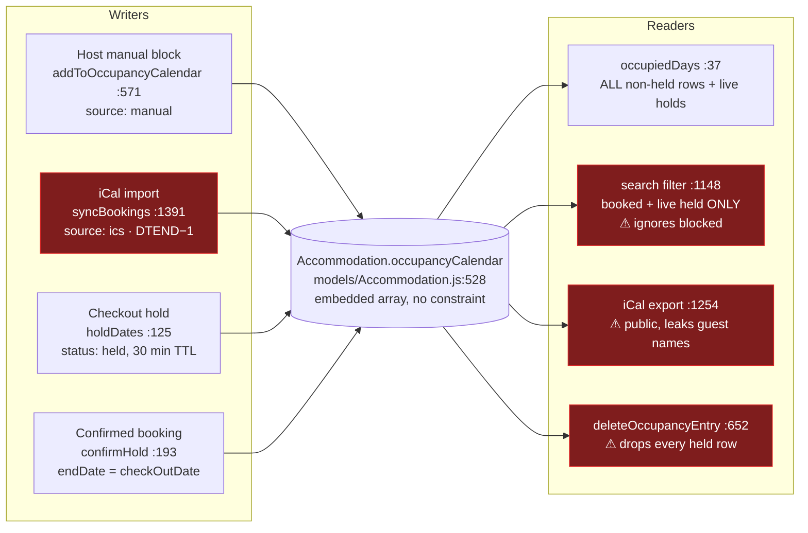
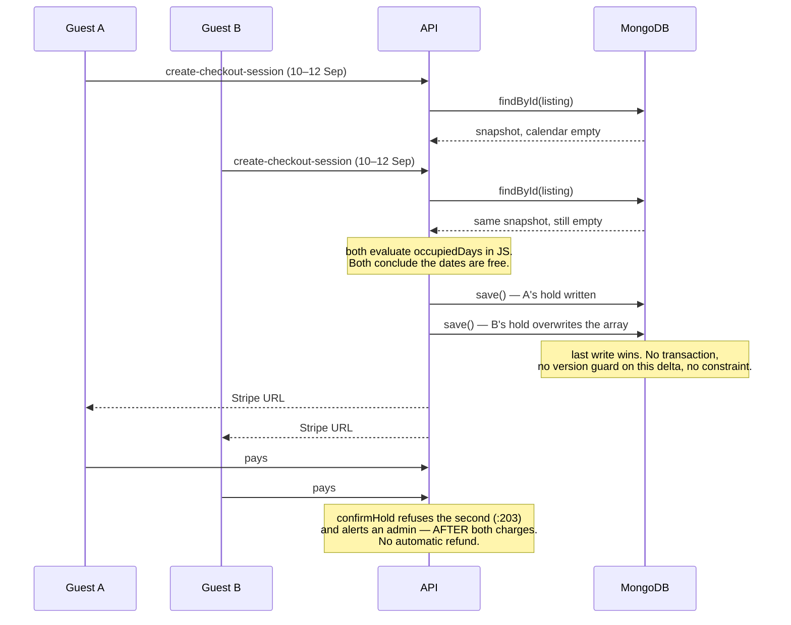
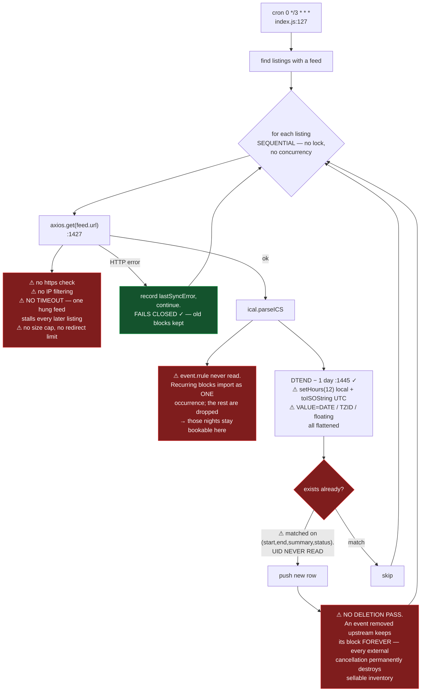
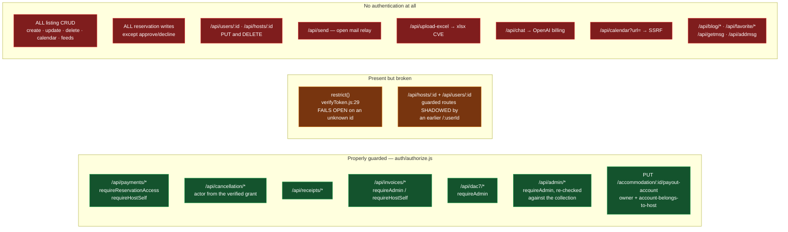
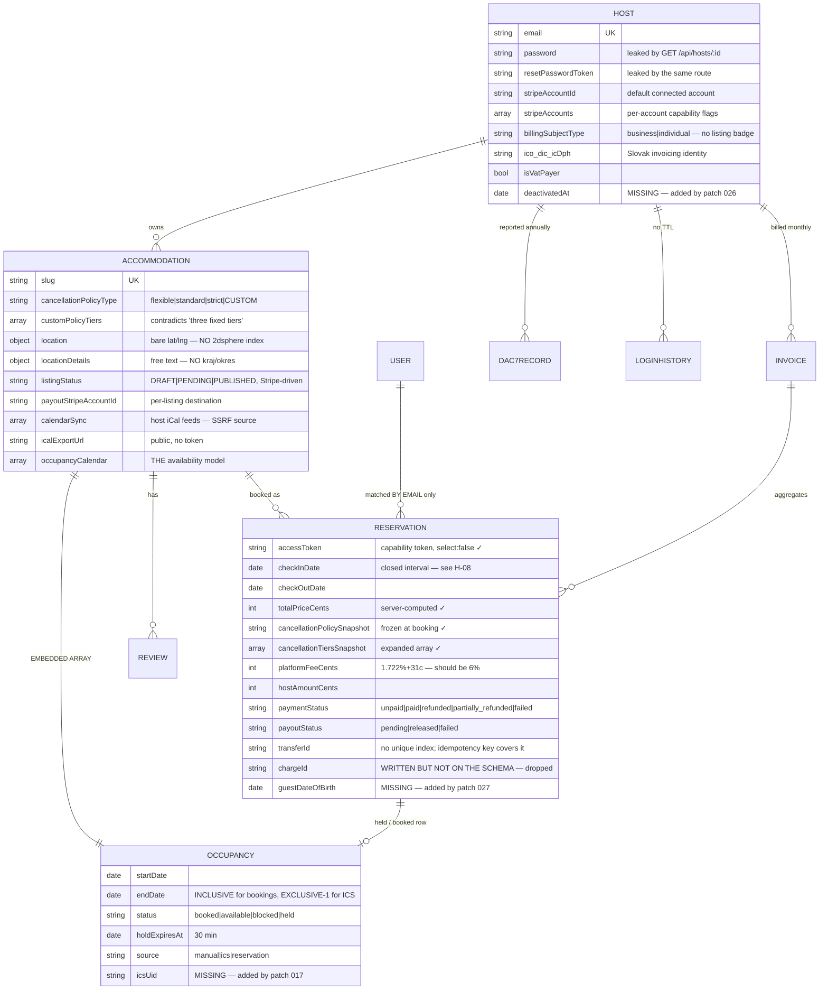

# Putko.sk — Architecture

Diagrams of the system as it actually is at commit `018cfa0`, not as designed. Where a component is missing, unauthenticated or broken, the diagram says so — a picture that hides the holes is worse than no picture.

---

## 1. System components and data flow

Two codebases live in this repository. Only one is in production.

**Read this diagram for what it says about ownership.** Every cron is in-process on a single Express instance with no lock and no leader election, so horizontal scaling on Render would run the payout sweep, the invoice job and the iCal import once per instance. The transfer idempotency key (`transfer_booking_<id>`) makes double payouts safe; nothing protects the iCal import or the 5-second cleanup the same way.

---

## 2. Booking state machine

There is no single status field. State is spread across `isApproved`, `paymentStatus`, `payoutStatus` and `bookingMode`, with no transition guard table anywhere. The diagram below composes them into the states the system actually occupies.

### Illegal transitions the code permits

Drawn separately, because they are the point.

```mermaid
stateDiagram-v2
    direction LR

    state "Cancelled" as C
    state "Paid + Approved" as P
    state "Payout released" as R
    state "Any state" as A
    state "Checked out" as O

    C --> P: ① applyPaidCheckoutSession<br/>filters on paymentStatus only,<br/>never reads isApproved :507
    A --> P: ③ PUT /reservations/:id<br/>totalPriceCents = 0, then approve<br/>:556 — unauthenticated, no charge
    P --> P: ② PUT /reservations/:id<br/>rewrite totalPriceCents<br/>:670 — unauthenticated
    R --> R: ④ clear transferId via ②,<br/>booking becomes payable again<br/>:1263
    O --> C: ⑤ cancel after check-out<br/>:108 — no check-out guard;<br/>dates released, guest emailed
    P --> P: ⑧ two concurrent approvals<br/>both hold the same dates<br/>:739 → holdDates race
```

| | Transition | Blocked by patch |
|---|---|---|
| ① | `cancelled` → `paid` | — needs an `isApproved` guard in `applyPaidCheckoutSession` |
| ② | `paid` → `paid` at a different amount | `003`, `006` |
| ③ | any → `approved`+`paid` with no charge | `003`, `006` |
| ④ | `released` → payable again | `003`, `006` |
| ⑤ | cancel after check-out | — |
| ⑥ | `released` → cancelled with refund | **already correctly refused** (`CancellationController.js:119`) |
| ⑦ | hold → confirmed over another booking | detected post-payment only (`calendarHold.js:203`) |
| ⑧ | concurrent request approvals | `011` |

---

## 3. Payment lifecycle — checkout to payout

### Money, per €100 booking

| | Now | Per the business rules |
|---|---|---|
| Guest pays | €100.00 | €100.00 |
| Stripe cost (≈1.4 % + €0.25) | €1.65 | €1.65 |
| Transferred to host | **€97.97** | **€94.00** |
| Platform retains | €2.03 | €6.00 |
| VAT booked on the fee | €0.38 | **€0.00** — not a VAT payer |
| Platform net | **€0.00** | **€4.35** |

The current configuration is calibrated to break even by design (`config/payments.js:16–28`). Patch `014` sets the commission to 6 % and the VAT rate to 0.

### Refund path

The snapshot mechanism works exactly as it should: `cancellationTiersSnapshot` is written at booking time and `calculateRefundCents` reads only from it. **No refund path JOINs back to the listing** — the CRITICAL failure the audit brief anticipated is not present here.

---

## 4. Availability model

One array, three writers, two interval conventions, four readers that disagree.

**The contradictions, concretely.**

* `W2` writes `endDate` = the **last blocked night** (`DTEND − 1`, `:1445`). `W4` writes `endDate` = the **checkout date**. `R1` treats both as inclusive, so every native booking over-blocks the checkout night and back-to-back stays are impossible (H-08).
* `R2` counts `booked` and live `held`. `R1` counts **everything** that is not an expired hold, `blocked` included — and, through an inverted condition, rows explicitly marked `available` too. So a host's manual block leaves the listing in search results and refuses the guest at checkout (H-03).
* `R4` filters the array to `['booked','blocked','available']`, so deleting one block destroys every in-flight checkout hold on the listing (H-19).
* There is **no database-level guarantee** against overlap. In Postgres this would be `EXCLUDE USING gist (listing_id WITH =, daterange(check_in, check_out, '[)') WITH &&)`. MongoDB has no equivalent, so the only atomic guard available is a conditional `findOneAndUpdate` whose *filter* asserts no overlap — which is what patch `011` does, and what the code did not do.

### The double-booking race

The window is the round trip between `findById` and `save()` — milliseconds, but every listing on a popular weekend is being hit by more than one guest at a time. Patch `011` closes it by making the database, not the application, evaluate the overlap predicate at write time.

---

## 5. iCal synchronisation

**Failure mode: fails closed.** An HTTP error, timeout or malformed feed records `lastSyncStatus: 'error'` and moves on, leaving existing blocks intact (`:1518–1528`). That is the safe direction, and it is what the code does. The problem is the opposite one — blocks are never released, so failure-closed compounds into permanent inventory loss.

**Realistic double-booking window against an external channel:** the 3-hour interval, and **unbounded** if any feed hangs, because there is no timeout and the loop is sequential. There is also no lock between runs; two overlapping runs both `save()` the same document.

Patch `005` adds the SSRF guard, timeout and size cap. Patch `017` adds UID-keyed dedup, move-on-change and per-feed deletion reconciliation, and detects-and-logs recurring events (expanding them needs a recurrence library — see `DECISIONS-NEEDED.md`).

---

## 6. Authorization map

The pattern is worth naming: **everything that touches Stripe was secured properly, and everything else was not.** `auth/authorize.js` is careful work — it derives the actor from whichever grant actually passed rather than from the token's claim (`:308`), it re-checks admin status against the collection rather than trusting the JWT (`:147`), and it fails closed on a lookup error (`:391`). That module was written by someone who understood the problem.

It was then applied to five routers out of twenty-three.

---

## 7. Data model

**Three structural notes.**

1. **`Reservation` has no `userId`.** Guests book without an account, so a booking is tied to its guest only by email (`auth/authorize.js:217`) plus a per-booking capability token. That is a deliberate and reasonable design for anonymous booking — but it means "all my bookings" cannot be answered reliably, and the commented-out `userId` field at `models/Reservation.js:85` is a trap for the next person who tries.

2. **Availability is an embedded array, not a collection.** That makes a single-document atomic update possible (patch `011` relies on it) but it also means the array grows without bound per listing, there is no index on the date ranges inside it, and the whole array is rewritten on every change.

3. **The Postgres rebuild models none of this.** `lib/db/drizzle/0000_zippy_eternals.sql` has four tables: guests, sessions, favourites, and `putko_test_host_accommodations` — whose entire listing payload is a single `jsonb` column. There is no bookings table, no availability, no payments. Any plan that says "we will fix this properly in Postgres" is describing work that has not started.
